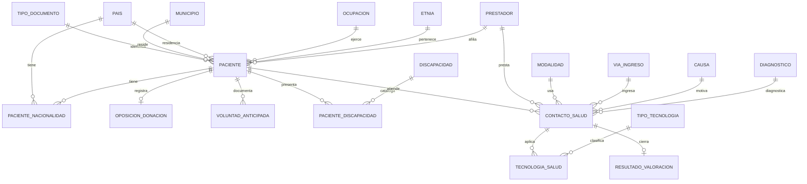

# Modelo Entidad-Relación — HCE Salud y Vida

Diagrama alineado con Resolución 866/2021 (alcance implementado).

## Entidades principales

- **PACIENTE**: núcleo de identificación y residencia.
- **PACIENTE_NACIONALIDAD**: cardinalidad N:M país–paciente.
- **OPOSICION_DONACION**: 1:1 con paciente (Ley 1805/2016).
- **CONTACTO_SALUD**: evento de atención (urgencias).
- **TECNOLOGIA_SALUD**: procedimientos, medicamentos, dispositivos, etc.
- **RESULTADO_VALORACION**: egreso, complicaciones, condición destino.

## Catálogos (tablas de referencia)

País, TipoDocumento, Municipio (DIVIPOLA), Diagnóstico (CIE-10), ModalidadTecnologia, ViaIngreso, CausaAtencion, TipoTecnologiaSalud, FinalidadTecnologia, PrestadorSalud, entre otros.
